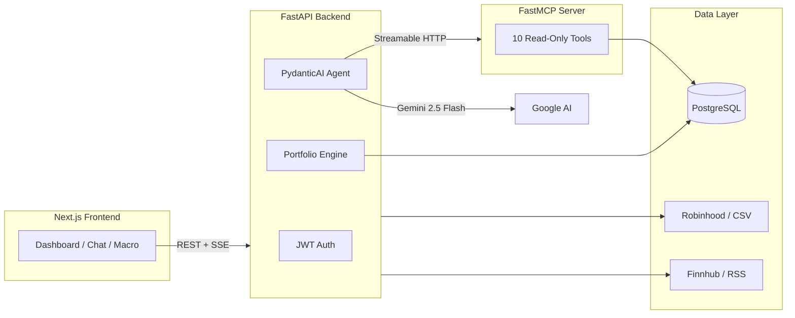

# Robinhood AI Portfolio Copilot

[](https://github.com/BPrakhar30/Robinhood_AI_Portfolio_Analyzer/stargazers)
[](https://github.com/BPrakhar30/Robinhood_AI_Portfolio_Analyzer/actions/workflows/ci.yml)
[](https://www.python.org/)
[](https://fastapi.tiangolo.com/)
[](https://nextjs.org/)
[](https://ai.pydantic.dev/)
[](https://modelcontextprotocol.io/)
[](LICENSE)

**Production-style AI portfolio copilot** - connect Robinhood (or import CSV/Excel), analyze holdings with macro context, detect allocation risk, and chat with a **PydanticAI agent** backed by **MCP tools** and **Gemini 2.5 Flash**.

> Reference implementation for **PydanticAI + MCP + FastAPI**: typed read-only tools, isolated MCP server, SSE streaming, cross-session memory, and OpenTelemetry via Logfire. Useful if you're building agentic fintech or learning production agent patterns.

**Quick start:** `cp .env.example .env` → set `GOOGLE_API_KEY` → `docker compose up --build` → open http://localhost:3000

### Who stars this?

- Engineers learning **MCP tool isolation** with a real FastAPI backend
- Builders shipping **AI portfolio / fintech copilots**
- Teams evaluating **PydanticAI + Logfire** in production-shaped code

If this saves you time, **[a star helps others find it](https://github.com/BPrakhar30/Robinhood_AI_Portfolio_Analyzer/stargazers)**.

---

## Demo

<!-- Add a 30-60s GIF here after recording (Dashboard → AI chat → Macro Pulse). -->
<!-- Recommended: record with OBS or Windows Game Bar, convert with ffmpeg or ezgif.com -->

| Dashboard | AI assistant | Macro pulse |
|:---:|:---:|:---:|
| *Add screenshot* | *Add screenshot* | *Add screenshot* |

---

## Why this repo

| Capability | What you get |
|---|---|
| **Agent architecture** | PydanticAI + FastMCP with 10 read-only portfolio tools and a research sub-agent |
| **Real brokerage data** | Robinhood MFA login, CSV/Excel import, transaction aggregation |
| **Portfolio intelligence** | Health score, sector concentration, ETF overlap, macro exposure |
| **Observability** | Logfire spans for LLM, MCP, SQL, and HTTP  -  OTel-compatible |
| **Security baseline** | JWT revocation, rate limits, Fernet encryption, CSP/HSTS headers |

## Architecture



---

## Features

- **User Authentication**  -  Registration, login, email verification (6-digit OTP), password reset, JWT-based sessions with stateless revocation (`token_version`), bcrypt hashing, and account lockout after failed attempts.
- **Account Deletion**  -  Users can permanently delete their account and all data from Settings, with confirmation dialog and cascade cleanup.
- **Robinhood Direct Connection**  -  Two-step MFA flow (SMS, email, TOTP, push notification) using `robin_stocks`. Includes 30-second countdown, auto-trigger, and inline status feedback.
- **CSV Import**  -  Upload positions CSV or Robinhood transaction export. Auto-detects Robinhood format and runs an aggregation engine computing positions from buy/sell/split/dividend transactions with live prices from Finnhub.
- **Plaid Integration (backend only)**  -  Adapter, endpoints, and service layer complete. Frontend Plaid Link widget planned for a future release.
- **Dashboard**  -  Portfolio overview with connected brokers, positions, unrealized gains, cash balance, Health Score widget, Risk Alert summary, and portfolio news sentiment breakdown (risk/positive/neutral counts with drill-through).
- **Broker Management**  -  Connect, sync, disconnect, or delete broker accounts. Encrypted token storage with Fernet.
- **Portfolio Health Score**  -  Composite 0-100 score from five sub-scores (diversification via HHI, single-stock concentration, ETF overlap, volatility via weighted beta, expense efficiency) with per-factor explanations and improvement suggestions.
- **Allocation Risk Detection**  -  Sector-overweight detection vs S&P 500, single-stock concentration thresholds (>10% yellow, >20% red), ETF overlap detection. Surfaced on Alerts page and dashboard widget.
- **Markets Page**  -  News tab with AI-enriched market summary headlines and recent developments. Portfolio News tab with per-holding company news, 3-bullet AI summaries, and sentiment tags (risk/positive/neutral). Sources aggregated from Finnhub plus eleven free RSS feeds (CNBC, Reuters, Yahoo Finance, Forbes, etc.).
- **Stocks Page**  -  Browsable grid of S&P 500 + user holdings with live quotes, stock icons, and owned-badge indicators. Stock Detail view with profile, quote, interactive price chart (1D-MAX ranges with hover tooltips), key stats, earnings history, company news, and AI analysis (chart interpretation, news impact, holdings effect).
- **Macro Pulse Page**  -  Nine macro indicators (VIX, 10Y Treasury, CPI, S&P 500, Dollar Index, PMI, High-Yield Spreads, Oil, Baltic Dry Index) with live values, health zones, and plain-language definitions. Portfolio macro exposure breakdown across six categories (Growth, Cyclical, Defensive, Rate-Sensitive, Commodity-Linked, International) with holding-level attribution. AI-generated macro summary connecting market conditions to the user's specific holdings.
- **AI Portfolio Assistant**  -  Full chat interface with resizable history sidebar, session rename/star/archive, persistent multi-turn context (40-message window), cross-session memory (up to 25 extracted facts), streamed SSE responses, MCQ-based clarification questions, and contextual suggested prompts. Powered by PydanticAI on Google Gemini 2.5 Flash with portfolio data via FastMCP. Includes a research sub-agent for stock screening, fundamentals comparison, and sector analysis.
- **Floating AI Chat Widget**  -  Draggable bottom-right chat widget accessible from any page. Page-aware suggested prompts, new-chat button, and expand-to-full-view link.
- **Observability**  -  Full-stack tracing via Pydantic Logfire: LLM calls, MCP tool calls, SQL queries, HTTP requests captured as structured spans. Console fallback for local dev.
- **Security Hardening**  -  Rate limiting (slowapi), CORS tightening, HTTP security headers (CSP, HSTS, X-Frame-Options, Referrer-Policy, Permissions-Policy), input validation with max_length constraints, pagination on all list endpoints, bounded TTL caches, PII redaction in logs, timing-safe token comparisons, generic error responses, non-root Docker users.
- **Settings**  -  Profile info, system diagnostics, logout, and account deletion (danger zone).
- **Responsive UI**  -  Next.js 16, Tailwind CSS, shadcn/ui, dark/light mode, protected routes, sidebar + topbar layout, custom error pages (404/500).
- **Dockerized Dev Environment**  -  `docker compose up --build` runs everything with bind mounts for live reloading.

## Tech Stack

- **Backend**: Python, FastAPI, SQLAlchemy (async), Pydantic, JWT, bcrypt, Fernet encryption, slowapi (rate limiting), Finnhub API, yfinance, async RSS aggregation
- **AI / Agent**: PydanticAI, Google Gemini 2.5 Flash (free tier, swappable), FastMCP (Streamable-HTTP transport), DuckDuckGo web search, research sub-agent with stock screener + fundamentals comparison + sector performance tools
- **Observability**: Pydantic Logfire (OpenTelemetry-compatible) with auto-instrumentation for PydanticAI, FastAPI, SQLAlchemy, and HTTPX
- **Frontend**: Next.js 16, React 19, TypeScript, Tailwind CSS, shadcn/ui, Zustand, TanStack Query, Recharts, react-markdown, Server-Sent Events for streaming
- **Database**: PostgreSQL 16 (UUID primary keys, JSONB, indexed foreign keys)
- **DevOps**: Docker, Docker Compose, concurrently (multi-process dev), non-root containers

## AI Backend Architecture

- **LLM Provider**  -  Google Gemini via Google AI Studio free tier (10 RPM / 250K TPM / 250 RPD on `gemini-2.5-flash`, no billing required). Set `GOOGLE_API_KEY` and optionally `GOOGLE_MODEL`. Provider-agnostic through PydanticAI.
- **Agent Framework**  -  PydanticAI. Typed, schema-first agents with built-in tool calling, streaming, and message-history replay.
- **Tool Protocol**  -  MCP (Model Context Protocol). Portfolio tools live in a separate FastMCP process and are consumed over Streamable HTTP for process-level isolation.
- **Portfolio Tools (10)**  -  The LLM sees only this fixed toolset; it cannot write SQL or reach the DB directly.
  - `get_holdings(limit)`  -  current positions ordered by market value.
  - `get_recent_transactions(limit)`  -  latest trades, dividends, fees.
  - `get_cash_position()`  -  latest cash balance from newest snapshot.
  - `get_performance_summary(period)`  -  portfolio value change over 1W/1M/3M/6M/1Y/ALL.
  - `get_position_for_symbol(symbol)`  -  user's position in a single ticker with weight %.
  - `get_symbol_profile(symbol)`  -  company/fund profile (sector, industry, description).
  - `get_symbol_quote(symbol)`  -  latest price, day change %, volume.
  - `get_symbol_key_stats(symbol)`  -  market cap, P/E, EPS, beta, 52-wk range, dividend yield.
  - `get_symbol_earnings(symbol)`  -  next earnings event + historical EPS beat/miss.
  - `get_symbol_candles_summary(symbol, period)`  -  OHLC summary (not raw bars) for trend analysis.
- **Research Sub-Agent**  -  Delegated via `research_and_analyze` tool for deep analysis: S&P 500 stock screener, multi-stock fundamentals comparison, GICS sector performance ranking, and DuckDuckGo web search for qualitative context.
- **User Memory**  -  Cross-session persistent memory (up to 25 facts extracted per user). Injected into system prompt for continuity across conversations.
- **MCQ Clarification**  -  When questions are too broad, the assistant asks structured multiple-choice questions to clarify preferences.
- **User-Scoping**  -  `user_id` injected server-side as MCP metadata via `process_tool_call`. The LLM never sees or forges it.
- **Read-Only by Design**  -  No write tools exposed. The agent cannot place trades or mutate account state.
- **Chat Persistence**  -  `ChatSession.agent_history` stores serialized PydanticAI messages. Last 40 messages replayed per turn.
- **Streaming**  -  SSE (`delta`/`done`/`error` events) with progress stages (thinking, analyzing portfolio, researching, etc.).
- **Lazy Construction**  -  Agent built at first use and memoized. Missing `GOOGLE_API_KEY` only 503s assistant routes.
- **Transport Security**  -  FastMCP runs with DNS-rebinding protection and host allow-list. No ports exposed from MCP container.

## Observability (Pydantic Logfire)

- **What's captured**  -  PydanticAI agent runs (model, tokens, cost, duration), MCP tool calls, FastAPI requests, HTTPX calls, SQLAlchemy queries. Backend and MCP server appear as two services linked by OTel trace IDs.
- **Privacy controls**  -  Default PII scrubber active. Set `LOGFIRE_SCRUB_PROMPTS=true` to redact user questions and LLM prompts.
- **Console fallback**  -  `LOGFIRE_CONSOLE=true` prints spans to stdout in dev.
- **Zero-config mode**  -  Empty `LOGFIRE_TOKEN` runs Logfire as a local no-op.
- **Not locked in**  -  Built on OpenTelemetry. Switch to Honeycomb/Datadog/Grafana Tempo via OTLP exporters.

## Security

- **Rate Limiting**  -  slowapi with per-endpoint limits (5/min register, 10/min login, 20/min AI queries). Falls back to in-memory storage when Redis is unavailable.
- **Authentication**  -  JWT with stateless revocation via `token_version`. bcrypt password hashing. Account lockout after 5 failed attempts (5-min cooldown via bounded TTL cache).
- **HTTP Headers**  -  CSP, HSTS, X-Frame-Options, X-Content-Type-Options, Referrer-Policy, Permissions-Policy. HTTPS redirect in production.
- **CORS**  -  Tightened to explicit methods and headers. Dev origins in debug mode only; single `FRONTEND_URL` in production.
- **Input Validation**  -  Pydantic `max_length` on all string fields, `Query` bounds on pagination, bounded caches to prevent memory exhaustion.
- **Error Sanitization**  -  Generic error messages to clients. No stack traces, no internal details, no PII in logs.
- **Encryption**  -  Fernet for broker tokens at rest. Timing-safe comparisons for OTP and reset tokens.
- **Production Startup Guard**  -  Refuses to start outside dev if secrets are defaults, debug is on, or frontend URL is insecure.
- **Docker**  -  Non-root `appuser` in both backend and frontend containers. `.dockerignore` excludes `.env` files.

## Running the App

### Option 1: Docker (Recommended)

1. Install and start [Docker Desktop](https://www.docker.com/products/docker-desktop/).
2. Copy `.env.example` to `.env` and configure. At minimum set `GOOGLE_API_KEY` (free at https://aistudio.google.com/apikey).
3. Build and start:
   ```
   docker compose up --build
   ```
4. Open:
   - Frontend: http://localhost:3000
   - Backend API: http://localhost:8000
   - Swagger Docs: http://localhost:8000/docs
5. Source code is bind-mounted  -  edit files and changes reflect automatically.
6. Stop: `docker compose down`

### Option 2: Local Development

1. Install Python dependencies:
   ```
   pip install -r requirements.txt
   ```
2. Install frontend dependencies:
   ```
   cd frontend && npm install
   ```
3. Copy `.env.example` to `.env` and configure. Set `DATABASE_URL`, `MCP_SERVER_URL=http://localhost:8765/mcp`, and `GOOGLE_API_KEY`.
4. Start PostgreSQL:
   ```
   docker compose up -d postgres
   ```
5. Start all three services (backend on 8000, MCP on 8765, frontend on 3000):
   ```
   cd frontend && npm run dev
   ```
   Runs FastAPI, FastMCP, and Next.js concurrently with colored logs. `Ctrl+C` stops all.

## Project Structure

```
app/
  main.py                    # FastAPI entry, middleware, exception handlers
  config.py                  # Pydantic Settings from .env
  auth/                      # Registration, login, email verification, JWT, password reset
  broker_integrations/       # Robinhood, Plaid, CSV adapters, sync, positions, transactions
  portfolio_engine/          # Health score computation, risk detection
  stocks/                    # Stock universe, detail, candles, AI analysis, news
  markets/                   # Market news (RSS + Finnhub), portfolio news, AI summaries
  macro/                     # Macro Pulse indicators, exposure scoring, AI summary
  ai_agent/                  # PydanticAI assistant, research sub-agent, memory, prompts
  mcp_server/                # FastMCP tool server (read-only portfolio data)
  chat/                      # Chat sessions CRUD, message persistence
  database/                  # SQLAlchemy engine, ORM models
  utils/                     # Logging, security, encryption, caching, observability
frontend/
  src/app/                   # Next.js pages (dashboard, markets, stocks, macro-pulse, etc.)
  src/features/              # Feature modules (auth, ai, stocks, markets, brokers, etc.)
  src/components/            # Shared UI components (layout, portfolio, visuals, feedback)
```
